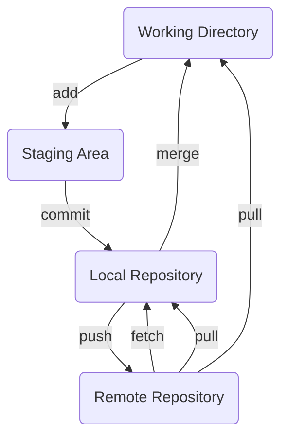

GitのWorkflowをMermaid記法で書いてみた。

```mermaid
flowchart TB

W1(Working Directory)
R1(Remote Repository)
L1(Local Repository)
S1(Staging Area)

R1 -- fetch --> L1
L1 -- merge --> W1
L1 -- push --> R1
W1 -- add --> S1
S1 -- commit --> L1
R1 -- pull --> W1
R1 -- pull --> L1
```

どうだろうか？
