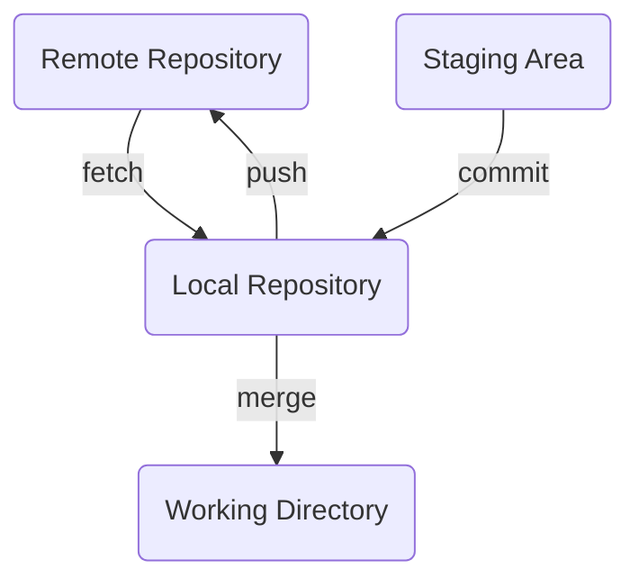

---
title:
---

```mermaid
flowchart TB


R1(Remote Repository)
L1(Local Repository)
S1(Staging Area)
W1(Working Directory)


R1 -- fetch --> L1
L1 -- merge --> W1
S1 -- commit --> L1


L1 -- push --> R1


```
R1 -- clone/pull --> W1